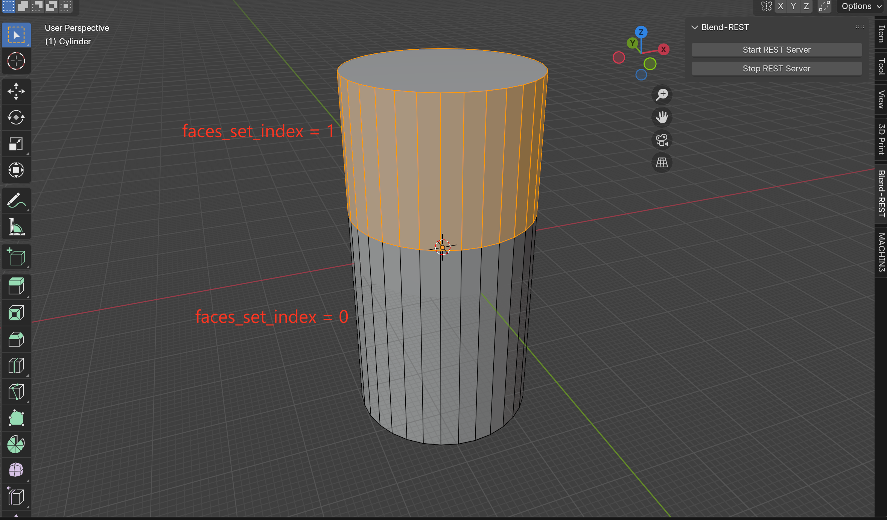
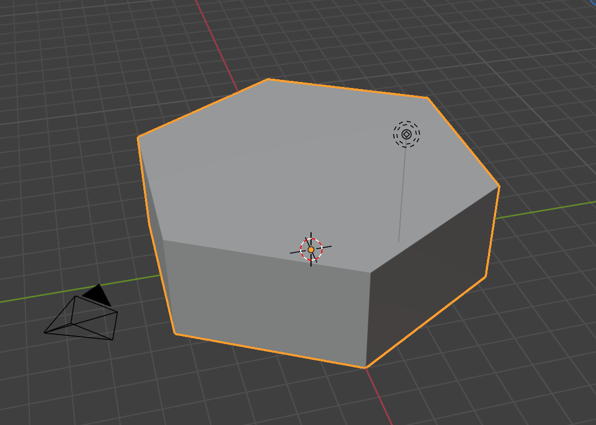

# Blend-REST

A Blender addon that provides a REST API server for programmatic 3D object creation and manipulation.

## 📦 Installation

### Install as Blender Addon
1. **Download the addon**: Get the `Blend-REST.zip` file from the repository
2. **Install in Blender**:
   - Open Blender
   - Go to `Edit` > `Preferences` > `Add-ons`
   - Click `Install...` and select the `Blend-REST.zip` file
   - Enable the addon by checking the checkbox next to "Blend-REST"
3. **Start the server**:
   - In the 3D View, look for the "Blend-REST" panel in the sidebar (N-key panel)
   - Click "Start REST Server" to start the API server on port 8000

## 🚀 REST API Endpoints

### GET /v1/models
Retrieve all objects in the current scene.

**Example:**
```bash
curl http://localhost:8000/v1/models
```

**Response:**
```json
[
  {
    "name": "Cube",
    "type": "MESH",
    "location": [0, 0, 0],
    "rotation": [0, 0, 0],
    "dimensions": [2, 2, 2]
  }
]
```

### GET /v1/status
Check server status and scene information.

**Example:**
```bash
curl http://localhost:8000/v1/status
```

**Response:**
```json
{
  "status": "ready",
  "objects": 5
}
```

### POST /v1/commands
Execute commands to create and manipulate objects.

## 🛠️ Supported Actions

### Create Object
Create any primitive object type.

**Request:**
```json
{
  "action": "create_object",
  "type": "cylinder",
  "params": {
    "radius": 1.0,
    "depth": 2.0,
    "location": [0, 0, 0],
    "rotation": [0, 0, 0]
  }
}
```

**Supported Types:** `cube`, `cylinder`, `uv_sphere`, `ico_sphere`, `cone`, `torus`, `plane`

**Parameters:** All standard Blender primitive parameters are supported.

### Modify Object
Modify properties of an existing object.

**Request:**
```json
{
  "action": "modify_object",
  "name": "Cylinder",
  "properties": {
    "location": [1, 2, 3],
    "rotation_euler": [0.5, 0, 0],
    "scale": [2, 1, 1]
  }
}
```

### Boolean Difference
Perform boolean difference operation with any primitive cutter.

**Request:**
```json
{
  "action": "boolean_difference",
  "target": "Cube",
  "cutter": {
    "type": "cylinder",
    "radius": 0.5,
    "depth": 2.0,
    "location": [0, 0, 0],
    "rotation": [1.5708, 0, 0]  // 90 degrees around X axis
  }
}
```

**Supported Cutter Types:** `cube`, `cylinder`, `uv_sphere`, `ico_sphere`, `cone`, `torus`, `plane`

### Select Faces
Select specific faces on an object based on criteria.

**Request:**
```json
{
  "action": "select_faces",
  "params": {
    "target": "Cylinder",
    "side": "external",  // "external", "internal", or "all"
    "faces_set_index": 0  // Optional: select specific ring segment (0, 1, 2, ...)
  }
}
```

**Parameters:**
- `target`: Name of the object to select faces on
- `side`: Face selection criteria:
  - `"external"`: Select faces facing outward
  - `"internal"`: Select faces facing inward  
  - `"all"`: Select all quad faces
- `faces_set_index`: Optional parameter to select specific segments created by bisect operations:
  - `0`: Faces before first bisect cut
  - `1`: Faces between first and second bisect cuts
  - `2`: Faces between second and third bisect cuts
  - `...`: And so on for multiple bisect operations

**Note:** The `faces_set_index` parameter is particularly useful after `bisect_plane` operations, allowing selection of specific segments created by the cuts.

**Example:**
After applying bisect operations to a cylinder, you can select different segments:



In this example, a single bisect operation creates two segments that can be selected using:
- `faces_set_index=0`: Faces on one side of the cut
- `faces_set_index=1`: Faces on the other side of the cut

The system supports multiple bisect operations, creating additional segments that can be selected with higher index values.

### Bisect Plane
Perform bisect plane operation on selected faces.

**Request:**
```json
{
  "action": "bisect_plane",
  "params": {
    "target": "Cylinder",
    "factor": 0.5  // Offset along cylinder axis
  }
}
```

### Add Thread
Add threaded details using MACHIN3tools plugin (requires MACHIN3tools addon installed).

**Request:**
```json
{
  "action": "add_thread",
  "params": {
    "target": "Cylinder",
    "position": [0, 0, 0],
    "radius": 0.2,
    "segments": 32,
    "loops": 10,
    "depth": 10,
    "fade": 15,
    "h1": 0.2,
    "h2": 0.2,
    "h3": 0.05,
    "h4": 0.05,
    "flip": false
  }
}
```

### Polygon Shape
Create custom polygon shapes from vertices and faces.

**Request:**
```json
{
  "action": "polygon_shape",
  "params": {
    "vertices": [
      [0, 0, 0],
      [1, 0, 0],
      [1, 1, 0],
      [0, 1, 0]
    ],
    "faces": [
      [0, 1, 2, 3]
    ],
    "location": [0, 0, 0],
    "name": "CustomPolygon"
  }
}
```

**Parameters:**
- `vertices`: Array of vertex coordinates [x, y, z]
- `faces`: Array of face vertex indices
- `location`: Object location [x, y, z] (default: [0, 0, 0])
- `name`: Object name (default: "PolygonShape")

**Example: Create a bolt head**
```json
{
  "action": "polygon_shape",
  "params": {
    "name": "BoltHead",
    "location": [0, 0, 0],
    "vertices": [
      [5, 0, 0], [2.5, 4.33, 0], [-2.5, 4.33, 0], [-5, 0, 0], [-2.5, -4.33, 0], [2.5, -4.33, 0],
      [5, 0, 3], [2.5, 4.33, 3], [-2.5, 4.33, 3], [-5, 0, 3], [-2.5, -4.33, 3], [2.5, -4.33, 3]
    ],
    "faces": [
      [0, 1, 2, 3, 4, 5], [6, 7, 8, 9, 10, 11],
      [0, 6, 7, 1], [1, 7, 8, 2], [2, 8, 9, 3],
      [3, 9, 10, 4], [4, 10, 11, 5], [5, 11, 6, 0]
    ]
  }
}
```



### Setup Scene
Configure Blender for small-scale modeling (0-300 mm).

**Request:**
```json
{
  "action": "setup_scene",
  "params": {
    "unit_scale": 0.001,
    "clip_start": 0.1,
    "clip_end": 10000,
    "grid_scale": 0.001
  }
}
```

**Parameters:**
- `unit_scale`: Unit scale (default: 0.001, 1 Blender unit = 1 mm)
- `clip_start`: Viewport clip start distance in mm (default: 0.1)
- `clip_end`: Viewport clip end distance in mm (default: 10000)
- `grid_scale`: Grid scale factor (default: 0.001)

### Undo/Redo
Undo or redo operations.

**Undo Request:**
```json
{
  "action": "undo"
}
```

**Redo Request:**
```json
{
  "action": "redo"
}
```

## 📋 Examples

### Create a Rotated Cylinder with Boolean Cut
```bash
curl -X POST http://localhost:8000/v1/commands \
  -H "Content-Type: application/json" \
  -d '{
    "action": "create_object",
    "type": "cylinder",
    "params": {
      "radius": 1.0,
      "depth": 2.0,
      "location": [0, 0, 0]
    }
  }'
```

```bash
curl -X POST http://localhost:8000/v1/commands \
  -H "Content-Type: application/json" \
  -d '{
    "action": "boolean_difference",
    "target": "Cylinder",
    "cutter": {
      "type": "cylinder",
      "radius": 0.2,
      "depth": 2.0,
      "location": [0, 0, 0],
      "rotation": [1.5708, 0, 0]
    }
  }'
```

### PowerShell Example
```powershell
$body = @{
    action = "boolean_difference"
    target = "Cylinder"
    cutter = @{
        type = "cylinder"
        radius = 0.2
        depth = 2.0
        location = @(0, 0, 0)
        rotation = @(1.5708, 0, 0)
    }
} | ConvertTo-Json

Invoke-RestMethod -Uri "http://localhost:8000/v1/commands" -Method Post -Body $body -ContentType "application/json"
```

## 🏗️ Project Structure

```
Blend-REST/
├── __init__.py              # Main Blender addon file
├── actions/                 # Modular action implementations
│   ├── create_object.py     # Create primitive objects
│   ├── modify_object.py     # Modify object properties
│   ├── boolean_difference.py # Boolean operations
│   ├── select_faces.py      # Face selection
│   ├── bisect_plane.py      # Bisect operations
│   ├── add_thread.py        # Thread creation
│   ├── undo.py              # Undo functionality
│   └── redo.py              # Redo functionality
├── examples/
│   └── create-cylinder.ps1  # Example PowerShell script
└── README.md               # This documentation
```

## 🔧 Development

### Adding New Actions
1. Create a new file in the `actions/` folder
2. Implement a function with the signature `execute_action_name(cmd)`
3. Import and register the function in `__init__.py`

### Module Reloading
The addon includes automatic module reloading for development:
```python
# In __init__.py
if 'bpy' in locals():
    reload_modules(bl_info['name'])
```

## 📝 Notes

- The REST server runs on `localhost:8000` by default
- All operations are queued and executed on Blender's main thread
- The addon requires Blender 3.6+ 
- Some features (like add_thread) require additional plugins
- Keep Blender open while using the API

## 🐛 Troubleshooting

### Common Issues
1. **"bpy is not defined"**: Ensure the addon is properly installed and modules are reloaded
2. **Server not starting**: Check Blender's console for error messages
3. **Commands not executing**: Verify the action name and parameters are correct
4. **"add_thread fails"**: Ensure MACHIN3tools addon is installed and enabled

### Debug Mode
Enable debug output by checking Blender's system console for detailed error messages and logs.

## 📜 License

This project is licensed under the **GNU General Public License v3.0**.  
See the [LICENSE](LICENSE) file for details.

## 🤝 Contributing

Contributions are welcome! Please feel free to submit pull requests or open issues for bugs and feature requests.
